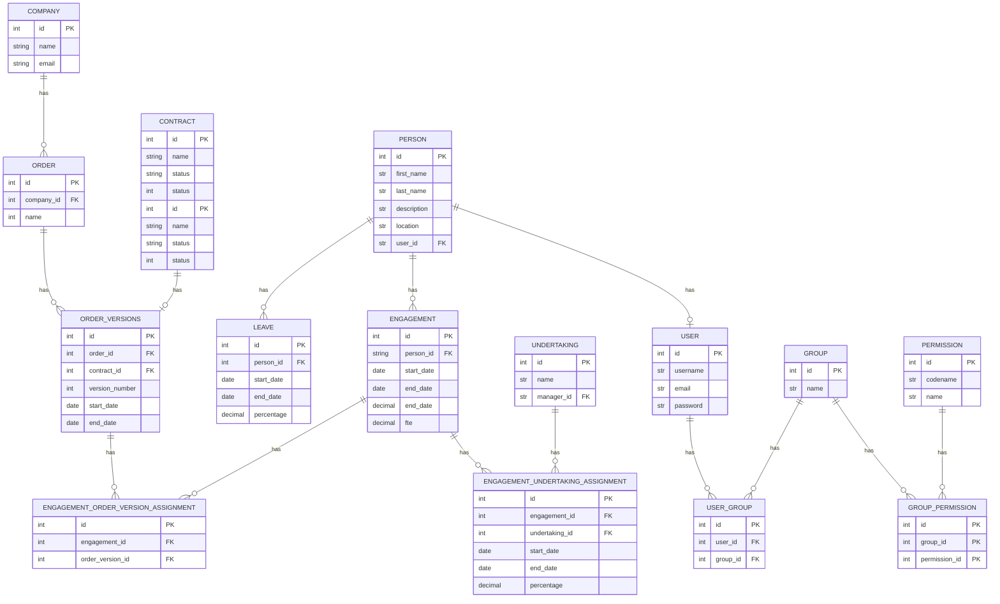

# Vendor Manager

A comprehensive Django application for managing vendors, contracts, orders, engagements, and people within an organization.

## Project Overview

Vendor Manager is a web-based application designed to help organizations manage their vendor relationships, contracts, orders, and engagements. The system provides functionality for tracking:

- Companies (vendors)
- Contracts with vendors
- Orders and order versions
- People (employees/contractors)
- Engagements (people assigned to orders)
- Undertakings (projects/tasks)
- Leaves (time off)

## Entity Relationship Diagram

Below is the entity relationship diagram showing the database structure:



## Features

- **Company Management**: Store and track vendor/company information
- **Contract Management**: Manage contracts with vendors
- **Order Management**: Track orders and their versions
- **People Management**: Manage employees/contractors
- **Engagement Tracking**: Assign people to orders and undertakings
- **Leave Management**: Track time off for people
- **Dashboard**: Visualization tools for data analysis
- **Role-based Permissions**: Control access using Django's authentication system

## Tech Stack

- **Backend**: Django 5.1+
- **Database**: PostgreSQL (configurable via environment variables)
- **Visualization**: Plotly, Django-Plotly-Dash
- **Frontend**: Django Templates with CSS
- **API**: Django REST Framework
- **Authentication**: Django's built-in authentication with django-role-permissions
- **Containerization**: Docker and Docker Compose

## Project Structure

The project is organized into the following Django applications:

- **companies**: Manages vendor/company information
- **contracts**: Handles contracts between your organization and vendors
- **dashboards**: Provides data visualization and reporting
- **engagements**: Manages assignments of people to orders and undertakings
- **leaves**: Tracks time off for people
- **orders**: Manages orders and their versions
- **people**: Handles employee/contractor information
- **undertakings**: Manages projects/tasks
- **vendor_manager**: Core project application with settings and global utilities

## Getting Started

### Prerequisites

- Docker and Docker Compose
- Python 3.13+ (for local development without Docker)

### Running with Docker

1. Clone the repository
2. Create a `vm-docker.env` file with the required environment variables (see sample below)
3. Build and start the containers:
   ```bash
   docker-compose up -d
   ```
4. Access the application at http://localhost:8000

### Environment Variables

Create a `vm-docker.env` file with the following variables:

```
DJANGO_SECRET_KEY=your_secret_key
DJANGO_DEBUG=True
DJANGO_ALLOWED_HOSTS=localhost,127.0.0.1
POSTGRES_DB=vendor_manager
POSTGRES_USER=postgres
POSTGRES_PASSWORD=your_postgres_password
```

### Local Development

1. Clone the repository
2. Create a virtual environment:
   ```bash
   python -m venv venv
   source venv/bin/activate  # On Windows, use: venv\Scripts\activate
   ```
3. Install dependencies:
   ```bash
   pip install -r requirements.txt
   pip install -r requirements-devel.txt  # For development extras
   ```
4. Set up environment variables (see above)
5. Run migrations:
   ```bash
   python manage.py migrate
   ```
6. Create a superuser:
   ```bash
   python manage.py createsuperuser
   ```
7. Start the development server:
   ```bash
   python manage.py runserver
   ```

## License

This project is licensed under the MIT License.
