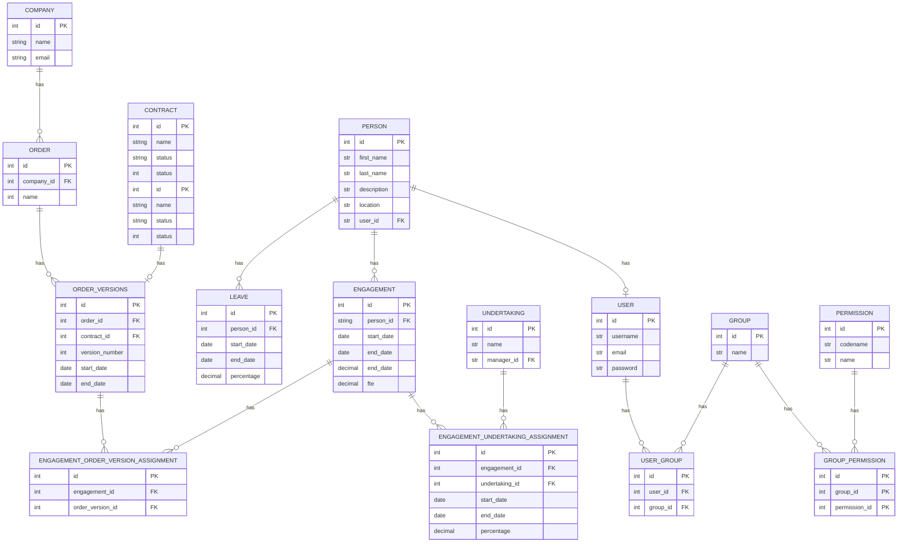

# Vendor Manager

A comprehensive Django application for managing vendors, contracts, orders, engagements, and people within an organization.

## Project Overview

Vendor Manager is a web-based application designed to help organizations manage their vendor relationships, contracts, orders, and engagements. The system provides functionality for tracking:

- Companies (vendors)
- Contracts with vendors
- Orders and order versions
- People (employees/contractors)
- Engagements (people assigned to orders)
- Undertakings (projects/tasks)
- Leaves (time off)

## Entity Relationship Diagram

Below is the entity relationship diagram showing the database structure:

```mermaid
erDiagram
    %% Define entities and relationships
    COMPANY {
        int id PK
        string name
        string email
    }

    CONTRACT {
        int id PK
        string name
        string status
        int status
    }

    CONTRACT {
        int id PK
        string name
        string status
        int status
    }

    ENGAGEMENT {
        int id PK
        string person_id FK
        date start_date
        date end_date
        decimal end_date
        decimal fte
    }

    ENGAGEMENT_ORDER_VERSION_ASSIGNMENT {
        int id PK
        int engagement_id FK
        int order_version_id FK
    }

    ENGAGEMENT_UNDERTAKING_ASSIGNMENT {
        int id PK
        int engagement_id FK
        int undertaking_id FK
        date start_date
        date end_date
        decimal percentage
    }

    LEAVE {
        int id PK
        int person_id FK
        date start_date
        date end_date
        decimal percentage
    }

    ORDER {
        int id PK
        int company_id FK
        int name
    }

    ORDER_VERSIONS {
        int id PK
        int order_id FK
        int contract_id FK
        int version_number
        date start_date
        date end_date
    }

    PERSON {
        int id PK
        str first_name
        str last_name
        str description
        str location
        str user_id FK
    }

    UNDERTAKING {
        int id PK
        str name
        str manager_id FK
    }

    USER {
        int id PK
        str username
        str email
        str password
    }

    GROUP {
        int id PK
        str name
    }

    USER_GROUP {
        int id PK
        int user_id FK
        int group_id FK
    }

    PERMISSION {
        int id PK
        str codename
        str name
    }

    GROUP_PERMISSION {
        int id PK
        int group_id PK
        int permission_id PK
    }


    %% Define relationships
    COMPANY ||--o{ ORDER: "has"

    ORDER ||--o{ ORDER_VERSIONS : "has"
    ORDER_VERSIONS ||--o{ ENGAGEMENT_ORDER_VERSION_ASSIGNMENT : "has"
    ENGAGEMENT ||--o{ ENGAGEMENT_ORDER_VERSION_ASSIGNMENT : "has"

    PERSON ||--o{ ENGAGEMENT : "has"

    PERSON ||--o| USER : "has"

    USER ||--o{ USER_GROUP : "has"
    GROUP ||--o{ USER_GROUP : "has"

    GROUP ||--o{ GROUP_PERMISSION : "has"
    PERMISSION ||--o{ GROUP_PERMISSION : "has"

    PERSON ||--o{ LEAVE : "has"

    CONTRACT ||--o| ORDER_VERSIONS : "has"

    ENGAGEMENT ||--o{ ENGAGEMENT_UNDERTAKING_ASSIGNMENT : "has"
    UNDERTAKING ||--o{ ENGAGEMENT_UNDERTAKING_ASSIGNMENT : "has"
```

## Features

- **Company Management**: Store and track vendor/company information
- **Contract Management**: Manage contracts with vendors
- **Order Management**: Track orders and their versions
- **People Management**: Manage employees/contractors
- **Engagement Tracking**: Assign people to orders and undertakings
- **Leave Management**: Track time off for people
- **Dashboard**: Visualization tools for data analysis
- **Role-based Permissions**: Control access using Django's authentication system

## Tech Stack

- **Backend**: Django 5.1+
- **Database**: PostgreSQL (configurable via environment variables)
- **Visualization**: Plotly, Django-Plotly-Dash
- **Frontend**: Django Templates with CSS
- **API**: Django REST Framework
- **Authentication**: Django's built-in authentication with django-role-permissions
- **Containerization**: Docker and Docker Compose

## Project Structure

The project is organized into the following Django applications:

- **companies**: Manages vendor/company information
- **contracts**: Handles contracts between your organization and vendors
- **dashboards**: Provides data visualization and reporting
- **engagements**: Manages assignments of people to orders and undertakings
- **leaves**: Tracks time off for people
- **orders**: Manages orders and their versions
- **people**: Handles employee/contractor information
- **undertakings**: Manages projects/tasks
- **vendor_manager**: Core project application with settings and global utilities

## Getting Started

### Prerequisites

- Docker and Docker Compose
- Python 3.13+ (for local development without Docker)

### Local development

Two supported dev modes.

**Mode A — Docker Compose for the database, Django on the host** (recommended).

1. `docker compose up -d db` starts PostgreSQL 17. Values come from `vm-docker.env`.
2. `pip install -r requirements.txt -r requirements-dev.txt`
3. `pre-commit install`
4. Export the DB env vars from `vm-docker.env` (or use `direnv`).
5. `python manage.py migrate && python manage.py runserver`

**Mode B — Pure SQLite, no containers** (fast smoke, CI).

1. `pip install -r requirements.txt -r requirements-dev.txt`
2. `export DJANGO_SECRET_KEY=dev DJANGO_DEBUG=true DATABASE_ENGINE=sqlite`
3. `python manage.py migrate && python manage.py runserver`

> The production deployment is **k3s**, driven by [.github/workflows/deploy.yaml](.github/workflows/deploy.yaml) on GitHub releases. See [docs/REQUIREMENTS.md](docs/REQUIREMENTS.md) NFR‑24a. There is no supported "Docker Compose in production" path.

### Environment variables

At minimum:

| Variable | Purpose | Notes |
| --- | --- | --- |
| `DJANGO_SECRET_KEY` | Django cryptographic key | Required in non-DEBUG. |
| `DJANGO_DEBUG` | Enables Django debug mode | Truthy values: `1`, `true`, `yes`, `on`. |
| `DJANGO_ALLOWED_HOSTS` | Comma-separated allowed hosts | Required in non-DEBUG. |
| `CSRF_TRUSTED_ORIGINS` | Comma-separated | Optional. |
| `DATABASE_ENGINE` | `sqlite` (default) or `postgresql` | |
| `DATABASE_NAME` / `DATABASE_USERNAME` / `DATABASE_PASSWORD` / `DATABASE_HOST` / `DATABASE_PORT` | PostgreSQL connection | Required when `DATABASE_ENGINE=postgresql`. |

## License

This project is licensed under the MIT License.
