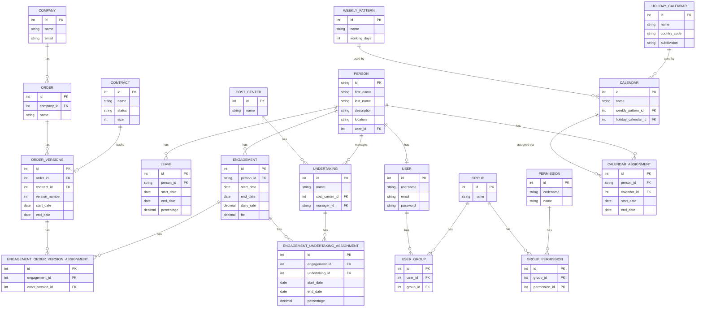

## Notes on the diagram

- **`PERSON.id`** is a business‑assigned string (max 6), not an integer. FK columns that reference it (`ENGAGEMENT.person_id`, `LEAVE.person_id`, `UNDERTAKING.manager_id`) are therefore string‑typed.
- **`PERSON.user_id`** is optional (nullable `OneToOneField`). A `Person` may exist without a login account; every logged‑in `User` must be linked to exactly one `Person` (see `FR‑23`).
- **`CONTRACT ↔ ORDER_VERSIONS`** is 1:1 by design. Each contract backs at most one order version; creating a new order version requires a new contract.
- **`COST_CENTER`** is a first‑class entity with its own business‑assigned integer PK (`FR‑7`).
- **Django auth tables** (`USER`, `GROUP`, `USER_GROUP`, `PERMISSION`, `GROUP_PERMISSION`) are shown for completeness. Which of them is used to model the three roles (`Person`, `UndertakingManager`, `Admin`) is an implementation choice per `FR‑25`.
- **`ENGAGEMENT.daily_rate`** and **`ENGAGEMENT.fte`** are `decimal`. `fte ∈ [0, 1]` per `FR‑12`.
- **`LEAVE.percentage`** and **`ENGAGEMENT_UNDERTAKING_ASSIGNMENT.percentage`** are `decimal(3, 2)` in `[0, 1]` per `FR‑17` / `OQ‑1`.
- **Calendars are additive to the ERD** (added post‑v1.2.1, out of the original refactor scope; see `FR‑55`–`FR‑60`). `WEEKLY_PATTERN.working_days` is a 7‑bit mask (bit 0 = Monday … bit 6 = Sunday). `HOLIDAY_CALENDAR` names an ISO‑3166 country (optional subdivision); the actual days are resolved dynamically via the `holidays` library — no per‑day rows are materialized. A `CALENDAR` bundles one `WEEKLY_PATTERN` with one `HOLIDAY_CALENDAR`. A `CALENDAR_ASSIGNMENT` is a time‑scoped, non‑overlapping link between a `PERSON` and a `CALENDAR` (nullable `end_date` means open‑ended). `weekly_pattern_id` and `holiday_calendar_id` FKs use `PROTECT` on delete; `calendar_id` on `CALENDAR_ASSIGNMENT` is also `PROTECT`; `person_id` on `CALENDAR_ASSIGNMENT` is `CASCADE` — deleting a person deletes their assignments.
