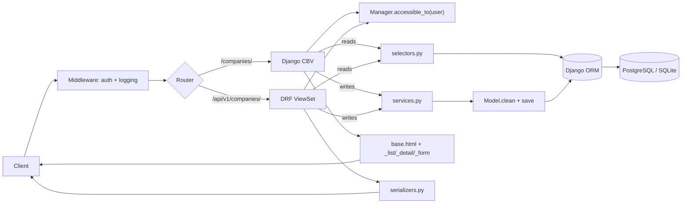
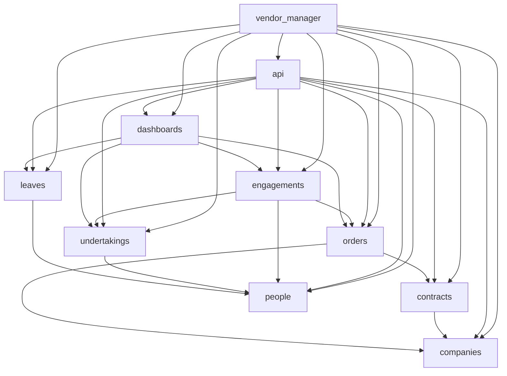

# Architecture

## Overview

Vendor Manager is a Django 5.1 monolith that exposes its functionality through two
parallel surfaces:

| Surface | Entry point | Auth |
|---|---|---|
| Server-rendered UI | `/` | Session (Django `LoginView`) |
| REST API | `/api/v1/` | HTTP Basic Auth |

Both surfaces share the same business logic — no logic is duplicated between UI views and
API viewsets.

---

## Application layout

```
vendor_manager/        ← project package (settings, urls, roles, wsgi)
companies/             ← Company CRUD
contracts/             ← Contract CRUD
people/                ← Person CRUD
orders/                ← Order + OrderVersion CRUD
undertakings/          ← Undertaking CRUD
engagements/           ← Engagement + assignment CRUD
leaves/                ← Leave CRUD
api/                   ← DRF router, serializers, viewsets
dashboards/            ← Dashboard (being phased out in P5)
```

Each domain app follows this internal structure:

```
<app>/
  models.py        ← data model, constraints, simple derived properties
  managers.py      ← custom QuerySet / Manager helpers
  services.py      ← write operations (create / update / delete)
  selectors.py     ← read-only computations and filtered querysets
  serializers.py   ← DRF serializers for the REST API
  views.py         ← thin UI views that delegate to services/selectors
  urls.py          ← URL patterns for the UI
  forms.py         ← Django forms for the UI
  admin.py         ← Django admin registration
  migrations/      ← database migrations
  tests/           ← pytest tests (models, services, API, permissions)
```

---

## UI + API split

```
Request
  │
  ├─► Django view (views.py)
  │       │  renders HTML template
  │       └─► services.py / selectors.py
  │
  └─► DRF viewset (api/viewsets.py)
          │  serializes JSON
          └─► services.py / selectors.py
```

- **Views** orchestrate: they validate form data (or delegate to DRF for serialization),
  call a service or selector, and return a response.
- **Services** encapsulate all write operations. A service function is the single place
  where a business operation is implemented. Both UI views and API viewsets call the same
  service.
- **Selectors** encapsulate read-only queries and computed properties. They return
  QuerySets or plain Python values — never HTTP responses.
- **Models** express structure, DB-level constraints, and simple derived properties. They
  do not call services.

---

## Request lifecycle

Every request travels through the same layers regardless of surface. The diagram below
is the end-to-end path for both `/companies/` (UI) and `/api/v1/companies/` (API):



Key properties enforced by this shape:

- **Auth first, always.** `IsAuthenticated` and `HasLinkedPerson` run before any view code — no path leaks unauthenticated bytes except
  `/health/`.
- **`accessible_to(user)` is the choke point.** No view / viewset fetches a queryset
  without funnelling it through the manager method.
- **Services run inside `transaction.atomic()`.** Multi-step writes either commit fully
  or roll back — the canonical case is `orders.services.create_new_order_version`
.

---

## Application dependency graph

Which app imports which. The graph is intentionally sparse — service and selector
boundaries keep it that way.



Rule of thumb: an arrow `A --> B` means `A` may import from `B`. The reverse MUST NOT
hold. If you need `B` to react to a change in `A`, put the coordination in a service on
the `A` side or in `dashboards`.

---

## Services / selectors layer

```python
# Example: creating an engagement
# Both the UI view and the API viewset call the same function.

# engagements/services.py
def create_engagement(*, person, start_date, end_date, daily_rate, fte):
    """Create and persist a new Engagement."""
    ...


# engagements/selectors.py
def get_active_engagements(person):
    """Return engagements that overlap today."""
    ...
```

Benefits:

- Business logic is tested once, independently of HTTP.
- The UI and API cannot diverge in behaviour.
- Services are easy to audit for authorization checks.

---

## Three roles

Vendor Manager uses `django-role-permissions` to declare three roles. Role assignment is
stored in Django's standard `auth_user_groups` table.

| Role | Description |
|---|---|
| `Person` | A vendor/contractor with a `Person` record. Can view and manage their own leaves. |
| `UndertakingManager` | An internal manager. Can view all records and manage undertakings. |
| `Admin` | Full access except contract mutation (contracts are managed externally). |

For the full permission matrix see [Roles & permissions](roles-and-permissions.md).

---

## OpenAPI / Swagger

The REST API is described by an OpenAPI 3 schema generated by
[drf-spectacular](https://drf-spectacular.readthedocs.io/):

| Endpoint | Purpose |
|---|---|
| `/api/v1/schema/` | Machine-readable OpenAPI 3 YAML |
| `/docs/api/` | Interactive Swagger UI |

The Swagger UI is the recommended way to explore and test the API interactively. It is
linked from this documentation site's navigation as **API reference**.
